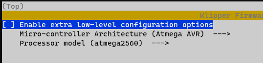

# KlipperSidekick
Klipper config and macros for use with the Lulzbot sidekick

# WARNING
This is very much a work-in-progress config. Use at your own risk and please be safe.
Also, please review [Issue #1](https://github.com/mcmillanje/klipperSidekick/issues/1).


## Firmware flashing
Follow the flashing instructions in [Klipper's Documentation](https://www.klipper3d.org/Installation.html)

Choose `Atmega AVR` as the architecture and `atmega2560` as the processor model on the menuconfig section.


Follow the instructions closely and if you receive any timeout messages power the printer off and back on again then retry.

## configuration

### printer.cfg
#### homing
Edit printer.config and uncomment the homing option of your choice:
1. low_current_home
z stepper current will be reduced to 15% then move down 10mm, then full current back up 10mm
If nozzle is correctly parked this will result in a quick down-up move pre-homing
If nozzle is resting on bed it won't be able to move down due to low current then will move up (to clear bed for xy home)
this is still bad for your printer and should be avoided (always park the nozzle) but it's better than nothing and doesn't require hardware mod
z_stop_home (WIP)
2. this will require the addition of a physical z endstop (I will make documentation). The homing macro will verify the gantry is properly parked before homing and either notify user or try to park itself if not. This will provide a fast and safe homing and would be the recommended method!
danger_home
3. This will provide a fast homing that skips the failsafes & assumes gantry is parked. If gantry isn't parked it will slam against the bed and likely cause damage. Don't use unless you're 100% always going to park your gantry no matter what!

#### toolhead
Uncomment the toolhead you're using. You can make multiple toolhead files for different configurations and easily switch this way.

TODO
z probe
pid

## slicer config (CURALE or other)
Macros contains a START_PRINT and END_PRINT macro
Replace start gcode with:
```
START_PRINT BED_TEMP={material_bed_temperature_layer_0} EXTRUDER_TEMP={material_print_temperature_layer_0}
```
Replace end gcode with:
```
END_PRINT
```


## reference material
### hardware
Schematic: https://github.com/ultimachine/EinsyRetro/blob/1.0b/board/Project%20Outputs%20for%20EinsyRetro/Schematic%20Prints_EinsyRetro_1.0b.PDF
OHAI: https://ohai.lulzbot.com/group/taz-sidekick-289/